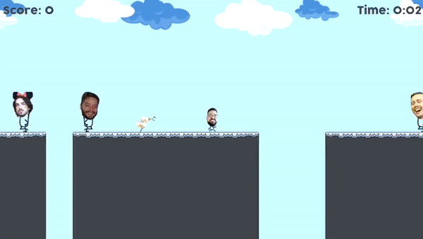

# Super Jeff

2D platform game written in Rust

## Building & Running Instructions

You need an up-to-date version of the rust toolchain installed. Follow the instructions on https://rustup.rs/

### Dependencies
SDL2, SDL2 Image, SDL2 TTF and SDL2 Mixer development libraries are required for building the game.

### Windows

For Windows all the necessary libraries and DLLs are bundled with the project. You can use the provided `env.ps1` to set the appropriate environment variables.

### *nix

For unix based OS you have to install the dependencies using your favorite package manager. Here are a few examples:

- Debian

    `apt install libsdl2-dev libsdl2-image-dev libsdl2-ttf-dev libsdl2-mixer-dev`
- Fedora

    `dnf install SDL2-devel SDL2_image-devel SDL2_ttf-devel SDL2_mixer-devel`
- OSX (Homebrew)

    `brew install sdl2 sdl2_image sdl2_ttf sdl2_mixer`

# Acknowledgements
- [Sunjay](https://github.com/sunjay/) for his awesome tutorials on gamedev in Rust.
- [PolyMars](https://github.com/PolyMarsDev) has a pretty good [video](https://www.youtube.com/watch?v=EAMHQfCGymg) on the development of [Cursor-Custodian](https://github.com/PolyMarsDev/Cursor-Custodian) it is c++ but I used as inspiration
- The [examples](https://github.com/Rust-SDL2/rust-sdl2/tree/master/examples) from rust-sdl2 were very helpful
- The art (if you can call it that) was made using [Krita](https://krita.org)
- Sounds using [sfxr](https://www.drpetter.se/project_sfxr.html) and [Audacity](https://www.audacityteam.org/)
- My Friends for letting me use their headshots like this lol
